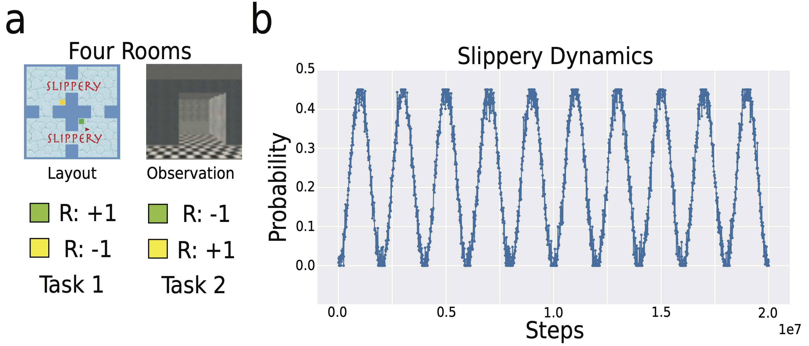
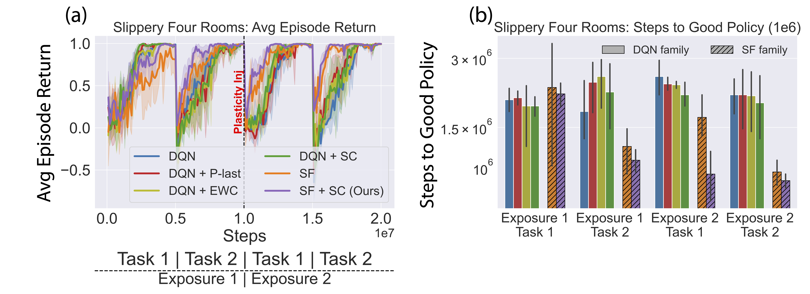

# Learning Successor Features across different timescales for continual non-stationary RL environments

This repository contains the official Jax implementation of the 3D Miniworld Four Rooms experiments from:

**Balancing Plasticity and Stability with Fast and Slow Successor Features**

which is accepted at ICML 2026.

The authors are Raymond Chua, Doina Precup and Blake Richards.

For the PyTorch implementation of the Mujoco experiments, check out [Multi-Timescales SFs PyTorch Implementation](https://github.com/raymondchua/multi-timescale-successor-features-mujoco) 

[Paper](https://arxiv.org/abs/2605.26357)

[Blog post]

## Introduction

A major challenge in continual reinforcement learning is balancing:

- Plasticity: adapting to new environments
- Stability: retaining previously learned knowledge

We study this problem under continuous non-stationarity, where environment dynamics evolve gradually over time rather than changing abruptly.

Our approach combines:

- Successor Features (SFs) as predictive state representations
- Multi-timescale synaptic consolidation mechanisms

to obtain learning systems that can adapt rapidly while remaining robust to forgetting.

## Overview
The implemented models include the following models:
- Double DQN (Hasselt et al., 2016)
- Double DQN with plasticity injection (Nikishin et al., 2023)
- Double DQN with continual backprop (Dohare et al., 2024)
- Double DQN with Elastic Weight Consolidation (Kirkpatrick et al., 2017)
- Multi-timescale synaptic consolidation on the parameters of Q-value (Kaplanis et al., 2018)
- SF Simple (Chua et al., 2024)
- Multi-timescale synaptic consolidation on the parameters of SFs (Our proposed model in the paper)

As described in the paper, to mimic slippery dynamics, we perturbed the agent's selected actions with a different random action based on a probability value.
The probability value is generated by a noisy sinusoidal process, which creates smooth changes in transition dynamics while preserving task objectives.

## Quickstart Guide 
This section provides a step-by-step guide to getting started.

### 1. Setting Up the Environment
We recommend using **Conda** for dependency management. To set up the environment, run:
```bash
conda env create -f conda_env.yml
conda activate multitimescale_sfs_fourrooms
```

### 2. Training 
Once the environment is set up, start the training by running:
```bash
python full_train_slippery.py
```

### 3. Modifying Training Parameters
The configuration file full_train_slippery.yaml controls training parameters such as num_train_frames etc. 
To log and visualize training progress, set use_wandb to True. 

## Architecture

Overview of the proposed architecture, which integrates Simple Successor Features (SFs) with multi-timescale Synaptic Consolidation (SC) in an DQN-like framework for discrete action tasks.

<p align="center">
  
</p>

## Experimental Setup

To induce continual non-stationarity, we continuously modify embodiment mass throughout training.

Perturbations are generated using:

- Periodic noisy sinusoidal processes
- Non-periodic noisy sinusoidal processes
- Ornstein–Uhlenbeck processes

The resulting dynamics create smooth changes in transition dynamics while preserving task objectives.

The figure below illustrates an example perturbation trajectory for the Humanoid embodiment.

<p align="center">
  
</p>


Here are the results based on the periodic noisy sinusoidal perturbations:

<p align="center">
  
</p>

## Structure
***
The repository is structured as follows:
```plaintext
multi-timescale-successor-features-fourrooms/
│── agent/                                                                                    # Implementations of the various agents
│   ├── BaseAgent.py                                                                          # Base agent for discrete actions
│   ├── DQN_agent.py                                                                          # Double DQN agent.
│   ├── DQN_cbp.py                                                                            # Double DQN agent with continual backprop (Dohare et al., 2024).
│   ├── DQN_consolidation_params_continuous_agent.py                                          # Double DQN agent with synaptic consolidation on the parameters of the Q-value network (Kaplanis et al., 2018).
│   ├── DQN_online_ewc.py                                                                     # Double DQN agent with elastic weight consolidation (Kirkpatrick et al., 2017).
│   ├── DQN_plasticity_injection_agent.py                                                     # Double DQN agent with plasticity injection (Nikishin et al., 2023).
│   ├── Epsilon_greedy_agent.py                                                               # Epsilon greedy agent with no learning. Used mainly for evaluation purposes.
│   ├── random_policy_bias_forward_agent.py                                                   # Random policy agent with a bias towards forward actions.
│   ├── sf_consolidation_params_continuous_agent.py                                           # SF agent with synaptic consolidation on the parameters of the SF network (Our contribution).
│   ├── sf_consolidation_params_continuous_softmax_attention_diff_unique_agent.py             # Extension of the SF agent with synaptic consolidation agent. Apply cross-attention across the various SFs learned across different timescales to study their relative contributions to learning performance  (Our contribution).
│   ├── simple_sf_agent.py                                                                    # Simple SF agent (Chua et al., 2024).
│   ├── simple_sf_online_ewc_agent.py                                                         # Variant of Simple SF agent with elastic weight consolidation (Kirkpatrick et al., 2017).
│
│── domain/                                                                                   # Domain interface of the Hallway and Four Rooms environments
│   ├── Miniworld/                                                                            # Use primarily for debugging and testing purposes.
│   ├── ├── Hallway_One_Task.py                                                               # Environment used in the paper.     
│   ├── ├── Miniworld_Two_Tasks.py                                                          
│   ├── Base_Domain.py                                                            
│   ├── Base_Domain_Miniworld.py
│                                                           
│── helpers/                                                                                  # Helper functions and classes for training and evaluation.
│   ├── dm_env_wrappers/                                                                      # dm_env wrapper for the Four Rooms environment.    
│   ├── replay_lib/                                                                           # helper functions for the replay buffer.
│   ├── run_loops/                                                                            # helper functions for the training and evaluation loops.               
│   ├── basic_tools.py                                                                        # helper functions for schedulers and checkpointing.          
│   ├── batch_renorm.py                                                                       # batch renormalization function (not used at the moment)
│   ├── cbp_state.py                                                                          # state representation for continual backprop (Dohare et al., 2024).
│   ├── coverage_logger.py                                                                    # helper functions for logging state coverage.              
│   ├── ewc.py                                                                                # helper functions for elastic weight consolidation (Kirkpatrick et al., 2017).             
│   ├── logger.py                                                                             # helper functions for logging training and evaluation metrics.         
│   ├── logging_and_metrics.py                                                                # helper functions for logging and computing training and evaluation metrics.       
│   ├── modulators.py                                                                         # helper functions for simulating the continuous, periodic and non-periodic changes of the environment.               
│   ├── optimizers.py                                                                         # helper functions for optimizers and learning rate schedulers.                                           
│   ├── processors.py                                                                         # helper functions for processing experience tuple with observations, rewards from the environment.             
│   ├── successor_features.py                                                                 # helper functions for collecting SFs from the synaptic consolidation mechanism
│    
│── img/                                                                                      # Images for the README file
│── losses/                                                                                   # loss functions for training the agents.                   
│── network/                                                                                  # network architectures for the agents. 
│── notebooks/                                                                                # Jupyter notebooks for plotting and visualizing training and evaluation results.
│── workspace/                                                                                # workspace for setting up training and evaluation scripts.
│── full_train_miniworld_slippery.py                                                          # for training the agents undergoing periodic changes in the 3D Miniworld Four Rooms environment.
│── full_train_miniworld_slippery_multitimescale_non_periodic.py                              # for training the agents undergoing non-periodic changes in the 3D Miniworld Four Rooms environment.    
│── full_train_miniworld_slippery_multitimescale_ou.py                                        # for training the agents undergoing changes based on an Ornstein–Uhlenbeck process in the 3D Miniworld Four Rooms environment.
│── miniworld_test.py 
```

## Acknowledgements
This repo is adopted from the [simple SFs repo](https://github.com/raymondchua/simple_successor_features) 


## Citations
***
If you find this repository useful in your research, please consider citing our paper:
```bibtex
@article{chua2026balancing,
  abbr={ICML},
  title     = {Balancing Plasticity and Stability with Fast and Slow Successor Features},
  author    = {Raymond Chua and Doina Precup and Blake A. Richards},
  journal =   {Proceedings of the 43rd International Conference on Machine Learning (ICML)},
  year      = {2026},
  url       = {https://arxiv.org/abs/2605.26357},
}
```

